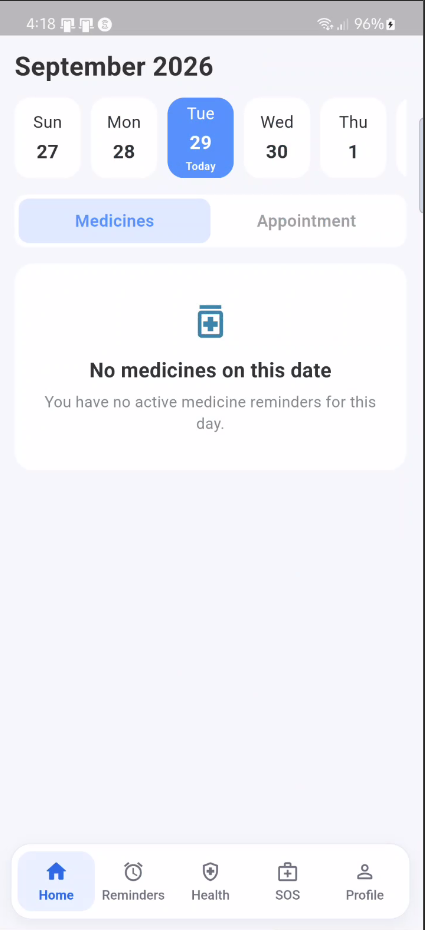
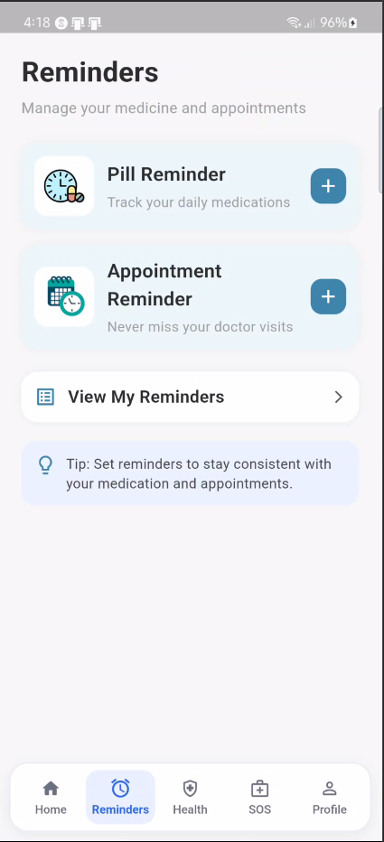
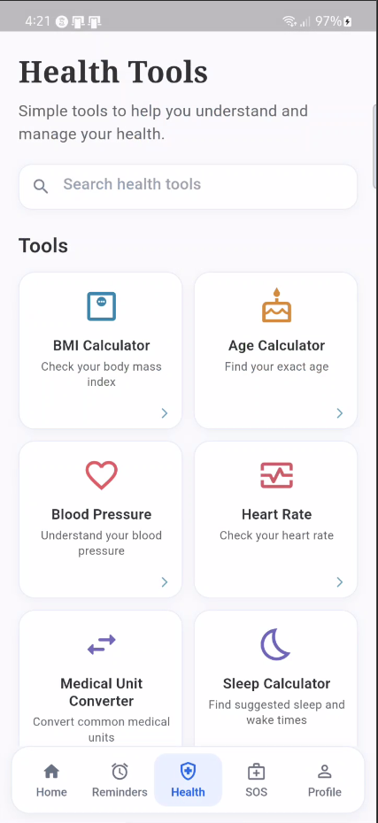
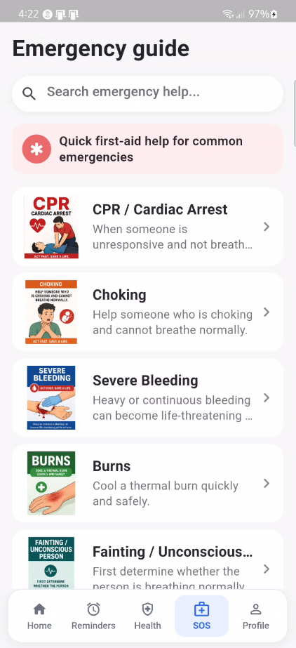
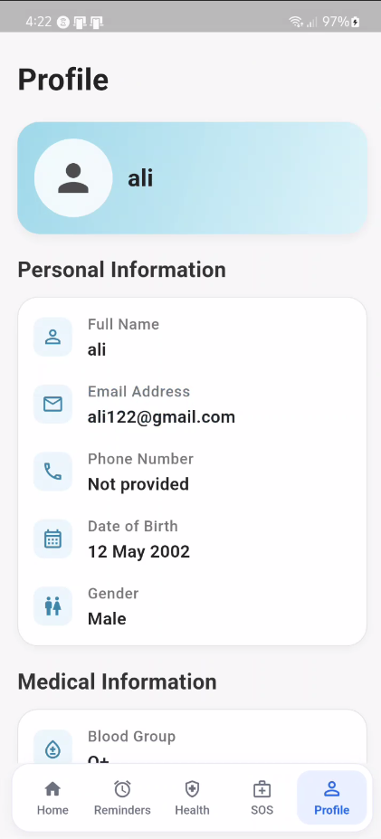
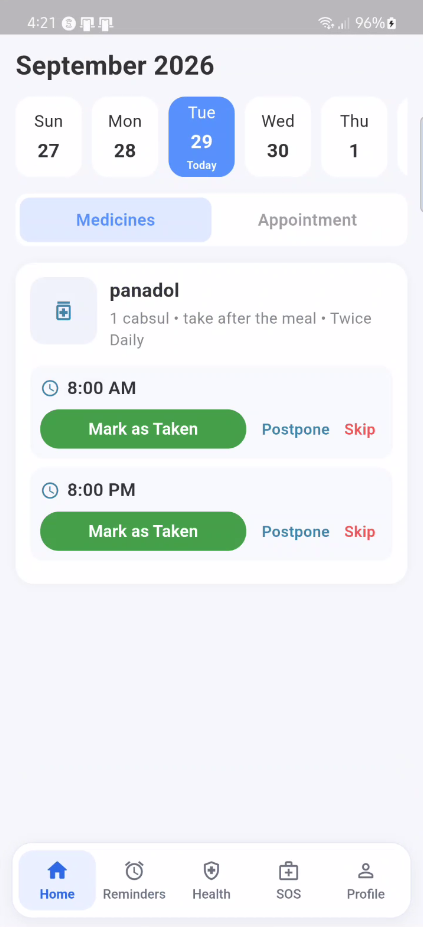

# Medelyra

Medelyra is a Flutter health companion app for organizing medication schedules, tracking doses, managing appointments, and accessing practical health and emergency tools. It combines local-first functionality with Firebase-backed authentication and user data where applicable.

## Features

- **Medication reminders** with scheduled local notifications
- **Medicine dose tracking** with **Take**, **Skip**, and **Postpone** actions
- **Appointment management and reminders**
- **Offline emergency/SOS guides** for quick access to step-by-step guidance
- **Health tools**
  - BMI
  - Age Calculator
  - Blood Pressure
  - Heart Rate
  - Medical Unit Converter
  - Sleep Calculator
- **User profile and medical information**
- **Firebase Authentication**
- **Google Sign-In**
- **Forgot password** and **change password**
- **Account deletion**
- **English and Arabic localization**
- **Light and dark mode**
- **Local notifications** with medicine and appointment reminder settings
- **Offline/local-first functionality** for core medication and appointment workflows

## Tech Stack

- **Flutter**
- **Dart**
- **Firebase Authentication**
- **Cloud Firestore**
- **SQLite** via `sqflite` for local storage
- **Flutter Local Notifications** with timezone support
- **Android and iOS**

## Architecture / Data

Medelyra uses a local-first approach for core medication and appointment workflows. SQLite stores medicines, appointments, and medicine dose statuses on the device, allowing these workflows to remain available without relying on a network connection.

Firebase is used for authentication and for authenticated cloud data where applicable, including user profiles and Firestore-backed records. Firestore rules scope user-owned data to the authenticated Firebase user ID.

## Security & Privacy

- Authentication is handled through Firebase Authentication, with email/password and Google Sign-In flows.
- Firestore security rules require an authenticated user and restrict user-owned documents to the matching Firebase user ID.
- Local medicine and appointment queries are scoped by the current user ID within the local database.
- The app provides password reset, password change, sign-out, and account deletion flows.
- A privacy policy screen is included in the app.

These measures describe the protections implemented in the current project and are not a guarantee of complete security. Users should keep their devices and account credentials protected.

## Project Structure

```text
lib/
├── auth/                 Authentication and password recovery screens
├── emergency/            SOS and emergency guide screens
├── health_tools/         Health calculators and unit converter
├── home/                 Main home screen and dose actions
├── l10n/                 English and Arabic localization resources
├── onboarding/           First-launch onboarding
├── profile/              Profile, settings, and notification preferences
├── reminders/            Medication and appointment reminder flows
├── services/             Firebase, local database, notification,
│                         language, and theme services
├── settings/             Profile editing, password, privacy, and support screens
├── widgets/              Shared navigation and UI widgets
├── firebase_options.dart Firebase configuration generated for the app
└── main.dart             App initialization, localization, themes, and routes

assets/
└── emergency_guides/     Emergency guide data and step images

android/                  Android project and release configuration
ios/                      iOS project and release configuration
test/                     Flutter widget tests
integration_test/         Integration tests
pubspec.yaml              Dependencies, assets, and Flutter project settings
firestore.rules           Firestore access rules
```

## Getting Started

### Prerequisites

- Flutter SDK compatible with the Dart SDK constraint in `pubspec.yaml`
- Android Studio and/or Xcode for device and platform builds
- A configured Android or iOS emulator/device
- Firebase project configuration for the target platforms

### Run locally

```bash
git clone https://github.com/Luaim/medelyra.git
cd medelyra
flutter pub get
flutter run
```

The repository includes the Firebase configuration required by the project. If setting up a different Firebase project, update the configuration using the standard FlutterFire setup process.

## Building

Create a release Android App Bundle with:

```bash
flutter build appbundle --release
```

## Testing

Run static analysis:

```bash
flutter analyze
```

Run the Flutter test suite:

```bash
flutter test
```

## Screenshots

<table>
  <tr>
    <td></td>
    <td></td>
    <td></td>
  </tr>
  <tr>
    <td></td>
    <td></td>
    <td></td>
  </tr>
  <tr>
    <td></td>
    <td></td>
    <td></td>
  </tr>
</table>

## Demo

https://github.com/user-attachments/assets/d15beb43-cc9d-4755-b7d5-97f17a07c012


## Project Status

Medelyra V1 is feature-complete and is maintained as a portfolio project.

## License

This repository does not currently include a license. A license can be added later.
